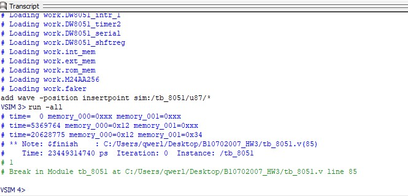
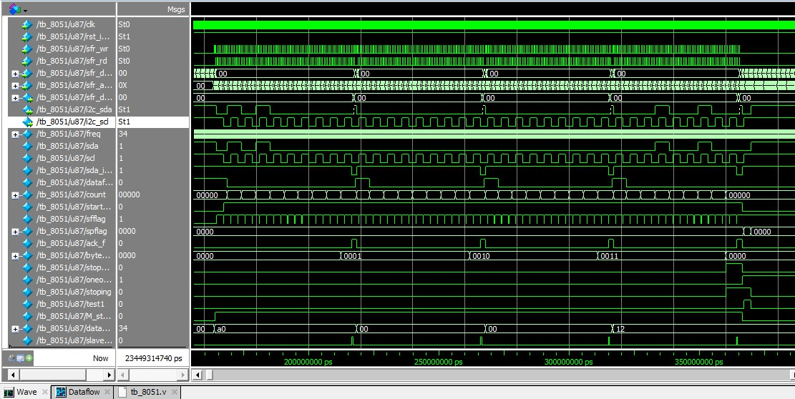

# DW8051_I2C_Master_IP
This project is made by Quartus Lite

- ## Goal
     - Creating a I2C Master IP of DW8051
     - In DW8051 program, write some datas to following addresses to EEPROM
       1. Address  0 : data => 0x12
       2. Address  1 : data => 0x34
     - Using M24AA256.v as I2C Slave EEPROM model
     - The Log text can't include error message
     - It require Synchronous Design, and it should use clk_50M or reset as clock, it can't use other signal as clock.

- ## Results
    - Log texts
      
    
    - The whole wave graph
      